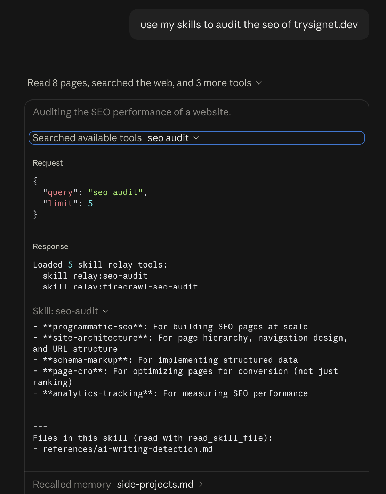
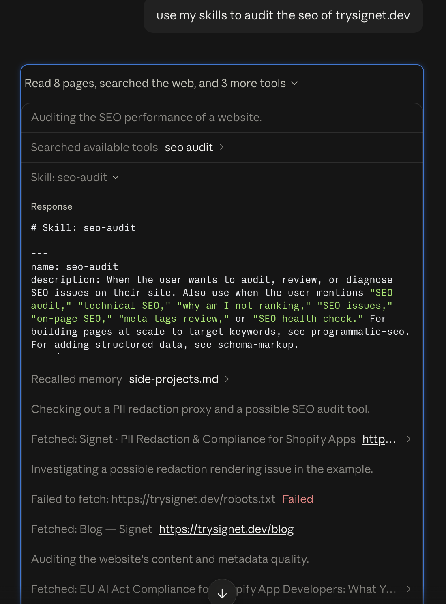
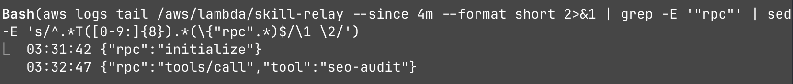
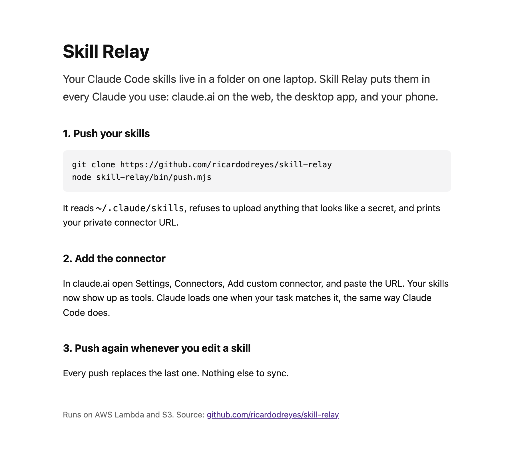

# Skill Relay

A remote MCP server on AWS Lambda that serves your Claude Code skills to claude.ai on the web, the desktop app, and your phone. One push command uploads your `~/.claude/skills` folder, one connector URL plugs it into Claude, and every skill shows up as its own tool that Claude can find and load on its own.

Live: https://o36lbkqwq54bltwrbozuqluxru0unmqg.lambda-url.us-east-1.on.aws/

## The problem

Skills are folders with a SKILL.md that tell Claude how to do one job the way you want it done (an SEO audit, a cold email, a code review). In Claude Code they load automatically when the task matches. But they live on one laptop, so the second you open claude.ai on your phone or the desktop app, they're gone. Same model, none of the playbooks.

claude.ai can take skills as zip uploads, one at a time, and they don't stay in sync with the folder you actually edit. I wanted the folder I already have to just show up everywhere. Push once, use it anywhere.

## Architecture

```
[~/.claude/skills]
        |
        v
[bin/push.mjs]  walks the folder, follows symlinks,
        |       skips binaries and files over 200 KB,
        |       refuses to push anything that looks like a secret
        |
   gzip POST /t/<token>/push
        |
        v
[Lambda Function URL] ---------> [S3: tenants/<sha256(token)>/bundle.json]
        ^                                     |
        |                                     |
   JSON-RPC POST /t/<token>/mcp               |
        |                                     |
[claude.ai connector] <-- tools/list: 1 tool per skill
                      <-- tools/call: that skill's SKILL.md
                      <-- read_skill_file: any file the skill references
```

**3 AWS pieces**, created by one rerunnable `./deploy.sh`:
- **Lambda** (Node 22, one file, no npm dependencies) serves the landing page, the push endpoint, and a stateless MCP Streamable HTTP endpoint
- **S3** holds one JSON bundle per user in a private bucket with all public access blocked; the key is the SHA-256 of the user's token, so the token itself is never stored
- **IAM**, where the Lambda role can read/write `tenants/*` in that one bucket and nothing else

## Key findings

Measured against the live deployment on 2026-10-02, with a library of 74 public skills:

| Metric | Value |
|--------|-------|
| **Skills served** | 74 (367 files, 2.8 MB on disk) |
| **Bundle after gzip** | 904 KB |
| **`tools/list` payload** | 49.9 KB, 75 tools |
| **`tools/call` latency, warm** | p50 489 ms, p95 537 ms (20 runs) |
| **`tools/list` latency, warm** | p50 639 ms, p95 790 ms (20 runs) |
| **Cold start (Lambda init)** | about 350 ms |
| **Skill claude.ai picked** | `seo-audit`, out of 74, from "use my skills to audit the seo of trysignet.dev" |

### What broke on the way

It took 3 tries in claude.ai before Claude actually loaded a skill. Each one taught me something about how claude.ai uses connector tools.

1. **One tool with the catalog in its description got ignored.** v1 had a single `load_skill` tool with every skill name and description packed into its description. claude.ai connected fine and listed the tool, then went straight to web fetch. The model matches on tool names, and `load_skill` says nothing about SEO.

2. **One tool per skill still got skipped, because claude.ai hid them.** v2 turned every skill into its own tool (`seo-audit`, `copywriting`, ...). The Lambda logs showed zero requests during the test chat. With a lot of connectors on, claude.ai defaults to "Load tools when needed", which keeps connector tools hidden until the model goes looking. For a plain "audit the seo" it never looked.

3. **"use my skills" makes it look.** Same server, new prompt: "use my skills to audit the seo of trysignet.dev". Claude searched the connector for "seo audit", got 5 matches back, picked `seo-audit`, and ran the audit off the playbook. The Lambda log shows the call at 03:32:47 UTC.

So the fix was partly server design (names over descriptions) and partly how you ask. Turning Tool access to "Tools already loaded" (the + menu in a chat, then Connectors, then Tool access) skips the search step entirely, though it costs context.

## Screenshots

### Claude searching the connector and finding the skill


### The skill loading in claude.ai


### The call landing in the Lambda logs


### Landing page


## Setup & run

### Prerequisites
- Node 18 or newer
- A `~/.claude/skills` folder (anything with a SKILL.md in it)

### Quick start

```bash
git clone https://github.com/ricardodreyes/skill-relay
node skill-relay/bin/push.mjs
```

That prints something like:

```
Pushed 74 skills (904 KB gzipped).

Connector URL (keep it private, it is the only key):
https://o36lbkqwq54bltwrbozuqluxru0unmqg.lambda-url.us-east-1.on.aws/t/<your-token>/mcp
```

### Connect it to claude.ai

1. Go to Settings, Connectors, Add custom connector
2. Name it, paste the URL, and leave Authentication on **No sign-in**
3. In a new chat, start with "use my skills to..." and Claude picks the skill

### Choose what gets pushed

```bash
# skip skills: one folder name per line
echo "my-private-skill" >> ~/.claude/skills/.relayignore

# or push only a list (a JSON array of folder names)
node skill-relay/bin/push.mjs --only names.json

# or a different folder
node skill-relay/bin/push.mjs --dir ./my-skills
```

Push again any time you edit a skill. Each push replaces the last one, and the token in `~/.skill-relay/token` stays the same, so the connector URL doesn't change.

### Run your own copy on AWS

```bash
aws sts get-caller-identity          # confirm the account
./deploy.sh                          # prints your Function URL
node bin/push.mjs --relay <your Function URL>
node lambda/test.mjs                 # handler checks, no AWS needed
```

## MCP endpoints

| Method | Path | Description |
|--------|------|-------------|
| GET | `/` | Landing page |
| POST | `/t/<token>/push` | Upload a gzipped skill bundle (cap 20 MB unzipped) |
| POST | `/t/<token>/mcp` | MCP JSON-RPC: `initialize`, `tools/list`, `tools/call`, `prompts/list`, `prompts/get`, `ping` |
| GET | `/t/<token>/mcp` | 405, there's no SSE stream since every request is stateless |

| Tool | Returns |
|------|---------|
| `<skill-name>` (one per skill) | That skill's SKILL.md, plus a list of its other files |
| `read_skill_file(name, path)` | One reference, script, or template file from a skill |

Every skill is also an MCP prompt, so clients with a prompt picker can load one by hand.

## Security

The token in the URL is the only key: 256 random bits, made on your first push and saved owner-only at `~/.skill-relay/token`. Anyone with your connector URL can read your skills, so treat it like a password (and crop it out of screenshots). To rotate it, delete that file, push again, and re-add the connector.

The push refuses to upload any file that matches an AWS key, an Anthropic/OpenAI key, a Stripe live key, a GitHub or Slack token, or a private key block.

## How this was built

I built this in one evening with Claude Code connected to my AWS account through the AWS CLI. It wrote the handler and the tests before touching AWS, then `deploy.sh`, then ran it. The first live call 500'd; Claude Code pulled the CloudWatch logs and found the Lambda role was missing `s3:ListBucket` (without it, S3 reports a missing file as AccessDenied instead of NoSuchKey). Then the 3 claude.ai attempts above, each one diagnosed from the Lambda logs.

The demo library is only skills that were already public. I didn't want mine going up. Claude Code compared every installed skill against the git tree hash recorded when it was installed and kept the 74 exact matches from public repos (coreyhaines31/marketingskills, firecrawl, heygen-com/hyperframes, vercel-labs/skills, remotion-dev/skills). 12 had drifted from upstream, so they stayed out. `allow.json` is that list.

## What I'd do with more time

- **OAuth instead of a token in the URL**, so a team can share one connector without sharing a secret
- **Team libraries**, one shared bundle with per-person overrides, since every engineer's skills folder drifts right now
- **Cache the bundle in Lambda memory by ETag**, since every request reads the whole 3 MB bundle from S3 and that's most of the 489 ms
- **Push on save** from a Claude Code hook, so the web copy is never stale
- **Rate limiting on push**, since anyone can create a tenant right now
- **Smaller tool descriptions** for big libraries; 74 skills is already 50 KB of `tools/list`

## Tech stack

| Tool | Purpose |
|------|---------|
| AWS Lambda (Node 22) + Function URL | MCP server, push endpoint, landing page |
| Amazon S3 | One private JSON bundle per user |
| AWS IAM | Role scoped to one bucket path |
| Model Context Protocol (Streamable HTTP) | How claude.ai talks to the server |
| Node 18+ standard library | The push CLI, no dependencies |
| Claude Code + AWS CLI | Built and deployed it |

## License

MIT
